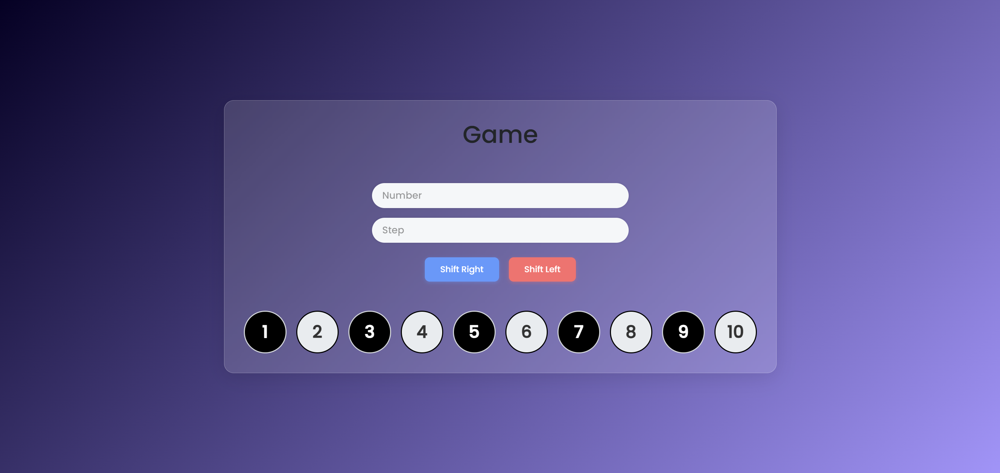

# Preview


# Number Swapping Project
This project allows users to swap numbers that are placed next to each other.

## Technologies Used
This project is built with:
- 
- 
- 

## Features
- Swap numbers that are placed next to each other.
- Visual feedback to indicate when numbers have been swapped.
- Simple and user-friendly interface.
- **Form validation**: Ensures valid input numbers for swapping.

## Installation
Steps to install and run the project.

```bash
# Clone the repository
git clone https://github.com/username/repository.git

# Navigate to the project folder
cd repository

# Open the project in a browser
open index.html
